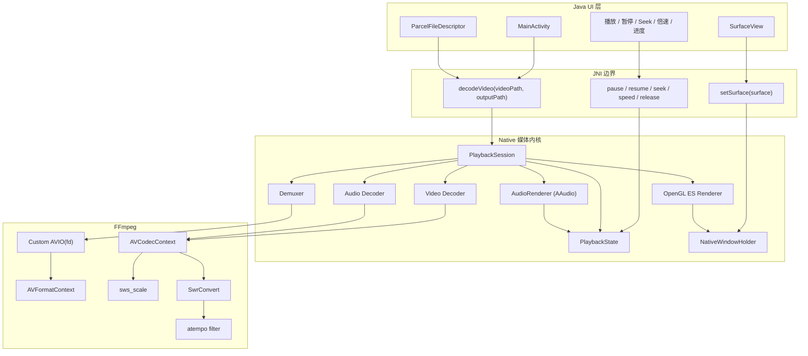
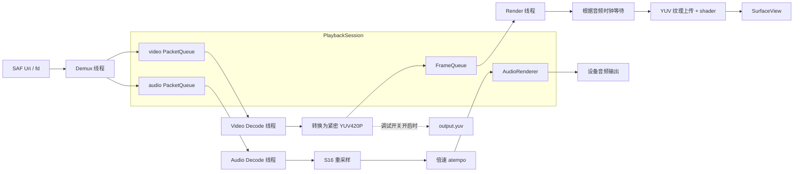
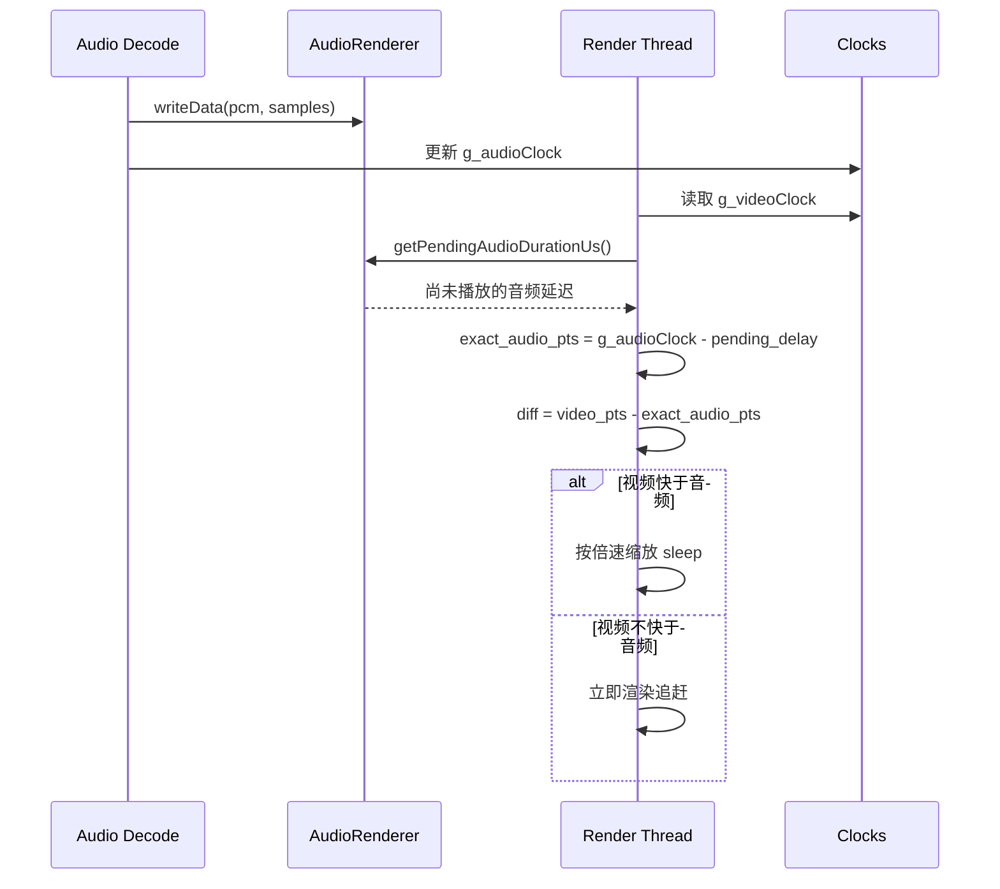
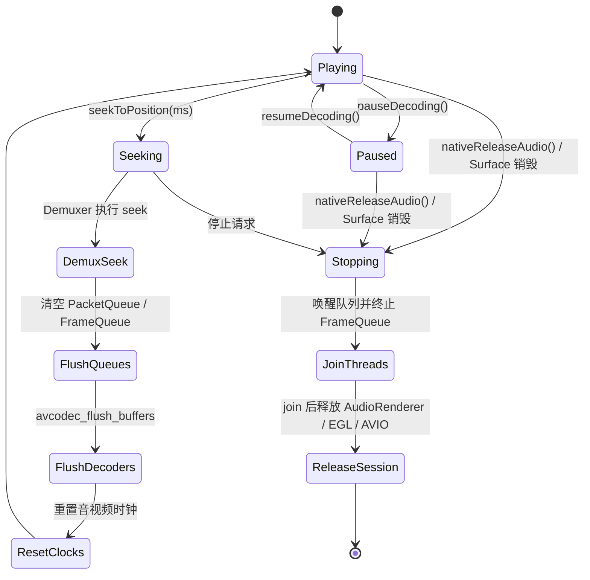
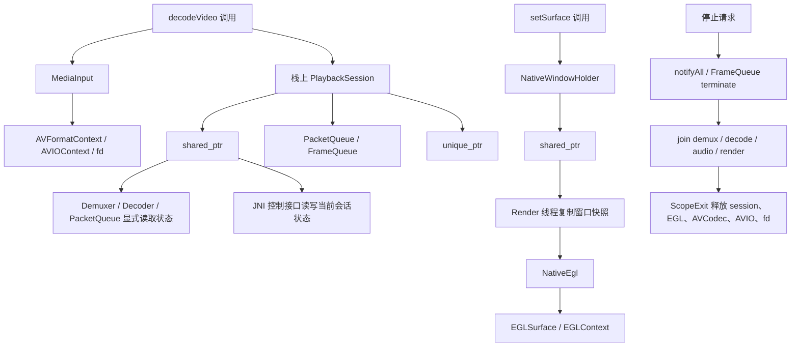

# VideoDecoder

VideoDecoder 是一个基于 **Android + JNI + FFmpeg + OpenGL ES + AAudio** 的原生播放器实验项目。它的重点不是封装系统播放器，而是把解复用、音视频解码、音频输出、OpenGL 渲染和播放控制拆开，形成一条可观察、可调试、可继续演进的 native 播放链路。

## 核心能力

- 本地视频文件选择与播放
- FFmpeg 解复用与软解码，支持音频和视频流
- OpenGL ES 将 YUV 视频帧渲染到 `SurfaceView`
- AAudio 低延迟音频输出
- 播放、暂停、恢复、Seek、倍速播放
- 倍速播放使用 FFmpeg `atempo`，实现变速不变调
- 通过进度条轮询 native 播放进度
- Material 3 卡片化 UI（24dp 圆角、语义化状态色、轻量动效）
- 可选导出 `output.yuv`，便于调试解码与渲染链路；默认播放不写 YUV 文件，减少 I/O 和存储压力

## 技术架构

项目采用 **Java UI 层 + Native 媒体内核** 的结构。Java 负责界面、文件选择和用户交互；C++ 负责媒体处理、线程编排、同步和渲染。



### 主要模块

- `MainActivity.java`：文件选择、Surface 生命周期、播放控制、进度显示
- `native-lib.cpp`：JNI 入口、`PlaybackSession` 会话上下文、线程创建与收束、音画同步
- `PlaybackState.h`：播放控制、Seek、时钟、进度和倍速等单次播放状态
- `MediaInput.cpp/.h`：普通路径和 `fd:` 输入封装，管理自定义 AVIO、fd 复制和输入资源释放
- `NativeEgl.cpp/.h`：EGL display、window surface、context 初始化与清理
- `NativeWindowHolder.cpp/.h`：Surface 到 `ANativeWindow` 的转换、引用快照和释放
- `ScopeExit.h` / `JniStringChars.h`：轻量 RAII 工具，管理作用域清理和 JNI 字符串生命周期
- `Demuxer.cpp/.h`：读取 `AVPacket`，分发到音频/视频队列，处理底层 seek
- `Decoder.cpp/.h`：视频解码，将源帧转换为紧密 `YUV420P` 后送入渲染队列，并在调试导出开启时写入 YUV 文件
- `AudioRender.cpp/.h`：AAudio 输出、内部 PCM 队列、缓冲延迟估算
- `videoRender.cpp/.h`：EGL/OpenGL ES 初始化、YUV 纹理上传、shader 转 RGB
- `queue.cpp/.h`：基于 `mutex + condition_variable` 的线程安全队列

## 播放线程模型

运行播放时会启动四条主要 native 线程：

1. Demux 线程：调用 `av_read_frame` 读取封装包，按 stream index 分发到音频/视频 `PacketQueue`。
2. Video Decode 线程：从视频队列取包解码，使用 `sws_scale` 转为紧密 `YUV420P`，按需写入调试 YUV 文件并推入 `FrameQueue`。
3. Audio Decode 线程：从音频队列取包解码，使用 `Swr` 转为 S16，再按播放速度进入 `atempo` 滤镜链，最后写入 AAudio 队列。
4. Render 线程：从 `FrameQueue` 取视频帧，根据音频时钟节奏控制渲染并执行 `eglSwapBuffers`。



`PacketQueue` 和 `FrameQueue` 都带背压控制，避免 demux 或 decode 过快造成内存无限增长。Seek 或停止时会清空队列并唤醒等待线程，保证线程可以退出或恢复。

## 音画同步

当前同步策略以音频播放进度作为主参考。视频渲染时根据音频已提交 PTS 和 AAudio/软件队列中尚未播放的延迟，估算当前真实音频位置：

```cpp
exact_audio_pts = g_audioClock - pending_audio_duration
diff = video_pts - exact_audio_pts
```



- `diff > 0`：视频快于音频，Render 线程短暂 sleep 等待。
- `diff <= 0`：视频不等待，继续渲染追赶音频。

倍速播放时，视频等待时长会按 `g_playbackSpeed` 缩放；音频侧通过 `atempo` 处理时间拉伸。

## Seek 与播放控制

Seek 使用两阶段握手机制：

1. Java 调用 `seekToPosition(ms)`。
2. Native 设置 `g_isSeeking=true` 和目标时间。
3. Demux 线程执行 `avformat_seek_file`，失败时回退到 `av_seek_frame`。
4. Demux 设置 `g_seekApplied=true`。
5. Audio/Video 链路清空旧队列、flush 解码器、重置时钟后恢复播放。



暂停/恢复通过原子状态控制，避免 UI 线程等待 native 阻塞操作。AAudio callback 在暂停时输出静音。

## Native 资源所有权



## 最近稳定性优化

近期已修复几类关键 native 风险：

- Render 线程初始化失败时会设置停止标志、唤醒 packet 队列并终止 `FrameQueue`，避免 Video Decode 线程卡死在 `FrameQueue::push()`。
- `g_audioRenderer` 的释放顺序调整为等待 Render 线程结束之后，避免 Render 线程读取已释放对象。
- `FrameQueue::clear()` 清空后会通知等待线程，避免 seek/清队列后生产者继续阻塞。
- Video Decode 不再假设源帧一定是紧密 `YUV420P`；现在统一用 `sws_scale` 转换后再写 YUV 和送渲染。
- OpenGL 上传 U/V 平面时按 `(width + 1) / 2` 和 `(height + 1) / 2` 计算，兼容奇数宽高。
- YUV 调试导出改为按需启用，默认播放路径不再持续写 `output.yuv`，降低长视频播放时的 I/O 和存储压力。
- `SurfaceView` 销毁时会请求 native 会话停止，并在播放线程结束后释放 native window，避免旧 Surface 被继续使用。
- 视频输入不再完整复制到 cache；Java 层通过 `ParcelFileDescriptor` 打开 SAF Uri，并把 `fd:<number>` 交给 native 自定义 AVIO，避免大视频启动前的整文件复制成本。
- Native 播放队列和 `AudioRenderer` 已收敛进 `PlaybackSession`，移除了全局 `g_audioRenderer` 和 `g_sessionActive`，降低跨会话裸指针和释放顺序风险。
- `ANativeWindow` 已改为带释放器的共享句柄，Render 线程使用窗口快照，避免 Surface 生命周期变化时继续读写悬空全局指针。
- Surface 到 `ANativeWindow` 的转换、锁保护、引用快照和释放已抽到 `NativeWindowHolder`，`native-lib.cpp` 不再直接维护 window 全局锁和 deleter。
- 播放控制、Seek、时钟、进度和倍速状态已收敛进 `PlaybackState`，`Demuxer`、`Decoder`、`PacketQueue`、`AudioRenderer` 不再通过 `extern` 读取全局播放状态。
- `decodeVideo()` 的 JNI 字符串、AVIO/fd、codec context 和 YUV 文件清理改为 `ScopeExit` 管理，减少初始化失败或早退分支漏释放资源的风险。
- JNI 字符串获取与释放已封装为 `JniStringChars`，避免 `decodeVideo()` 手动维护 `ReleaseStringUTFChars` 分支。
- 清理未使用的单队列 `Demuxer::demux()` 重载和 `Decoder` 内部冗余 `FrameQueue` 成员，缩小 native 模块维护面。
- 普通文件路径和 SAF `fd:` 输入已抽到 `MediaInput`，`native-lib.cpp` 不再直接维护 custom AVIO/fd 打开与释放细节。
- EGL display、surface、context 初始化与清理已抽到 `NativeEgl`，进一步减薄 `native-lib.cpp` 的平台渲染细节。

已验证：

```powershell
.\gradlew.bat assembleDebug
.\gradlew.bat testDebugUnitTest
```

## UI 设计与交互（基于 `DESIGN.md`）

当前首页 UI 已按 Deadliner 风格语言完成一轮改造，重点如下：

- **卡片语言**：主要信息区统一为 24dp 圆角卡片，使用 `surfaceContainer*` 分层而不是重阴影。
- **状态语义色**：引入四态色并做浅色/深色资源分离，避免在布局中硬编码颜色。
- **状态联动**：`MainActivity` 会根据播放状态映射并联动更新 chip、卡片底色、解码按钮、播放/暂停/倍速/选择视频按钮，以及 SeekBar 强调色。
- **动效节奏**：页面首屏采用 staggered `fade + slight slide` 入场；状态切换使用 180ms fade；状态文案（如“已选择视频”“正在解析视频”“解析结束”）采用统一 fade + text swap。

### 状态映射

- `PLAYING -> UNDERGO`
- `PAUSED -> NEAR`
- `IDLE -> PASSED`
- `READY -> COMPLETED`

### 状态色资源

- 日间：`app/src/main/res/values/colors.xml`
- 夜间：`app/src/main/res/values-night/colors.xml`

已定义四组 token（每组含 chip、card、button 前景/背景）：

- `state_undergo_*`
- `state_near_*`
- `state_passed_*`
- `state_completed_*`

## 构建要求

- Android Studio
- Android SDK 35
- Android NDK + CMake
- Java 11
- Gradle Wrapper 使用仓库内 `gradlew` / `gradlew.bat`

### Windows

```powershell
.\gradlew.bat clean
.\gradlew.bat assembleDebug
.\gradlew.bat testDebugUnitTest
```

### Unix/macOS

```bash
./gradlew clean
./gradlew assembleDebug
./gradlew testDebugUnitTest
```

## 平台限制

项目当前仅支持 **`arm64-v8a`**：

- `app/build.gradle` 中固定了 `abiFilters "arm64-v8a"`。
- FFmpeg 预编译库位于 `app/src/main/jniLibs/arm64-v8a/libffmpeg.so`。
- 不要在 x86/x86_64 模拟器上测试，运行时会找不到或无法加载 native FFmpeg 库。

请使用 arm64 真机或兼容的 arm64 环境验证播放。

## 文件地图

```text
app/
├─ src/main/java/com/example/videodecoder/
│  ├─ MainActivity.java
│  ├─ PlaybackInputPolicy.java
│  ├─ PlaybackTimeFormatter.java
│  └─ PlaybackUiPolicy.java
├─ src/main/res/layout/activity_main.xml
├─ src/main/res/drawable/
│  ├─ bg_deadliner_surface.xml
│  └─ bg_deadliner_chip.xml
├─ src/main/res/values/colors.xml
├─ src/main/res/values/themes.xml
├─ src/main/res/values-night/colors.xml
├─ src/main/res/values-night/themes.xml
├─ src/main/cpp/
│  ├─ native-lib.cpp
│  ├─ MediaInput.cpp/.h
│  ├─ NativeEgl.cpp/.h
│  ├─ NativeWindowHolder.cpp/.h
│  ├─ ScopeExit.h
│  ├─ JniStringChars.h
│  ├─ Demuxer.cpp/.h
│  ├─ Decoder.cpp/.h
│  ├─ queue.cpp/.h
│  ├─ videoRender.cpp/.h
│  ├─ AudioRender.cpp/.h
│  └─ include/
└─ src/main/jniLibs/arm64-v8a/libffmpeg.so
```

## JNI 接口

- `decodeVideo(String videoPath, String outputPath)`
- `setSurface(Surface surface)`
- `pauseDecoding()`
- `resumeDecoding()`
- `setPlaybackSpeed(float speed)`
- `seekToPosition(int progressMs)`
- `getDurationMs()`
- `getCurrentPositionMs()`
- `nativeReleaseAudio()`

## 已知限制与后续方向

- 视频输入当前通过 native 自定义 AVIO 直接读取已授权 fd。少数内容提供方如果返回不可 seek 的 fd，Seek 能力可能受限。
- YUV 导出当前保留为 native 调试能力，默认 UI 播放路径关闭；后续可补一个显式调试开关。
- 当前主要验证方式是构建、单元测试和 arm64 设备手动播放；native 同步链路仍需要更多端到端场景测试。
- `native-lib.cpp` 仍承担 JNI、线程编排、音画同步和资源释放等多重职责；后续可继续拆分为更独立的 session/controller 模块。
- native 同步链路仍需要更多设备级回归测试，尤其是连续 seek、倍速切换、Surface 销毁重建和长视频播放。
