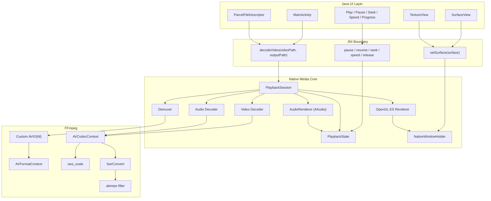
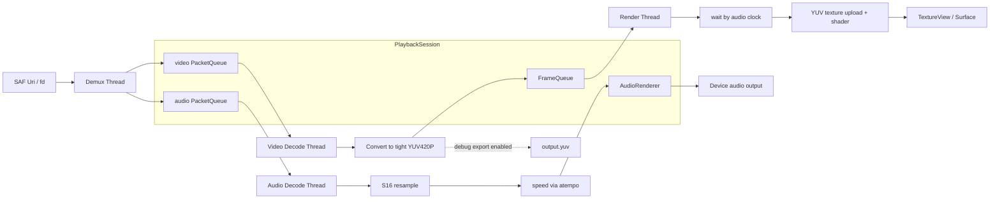
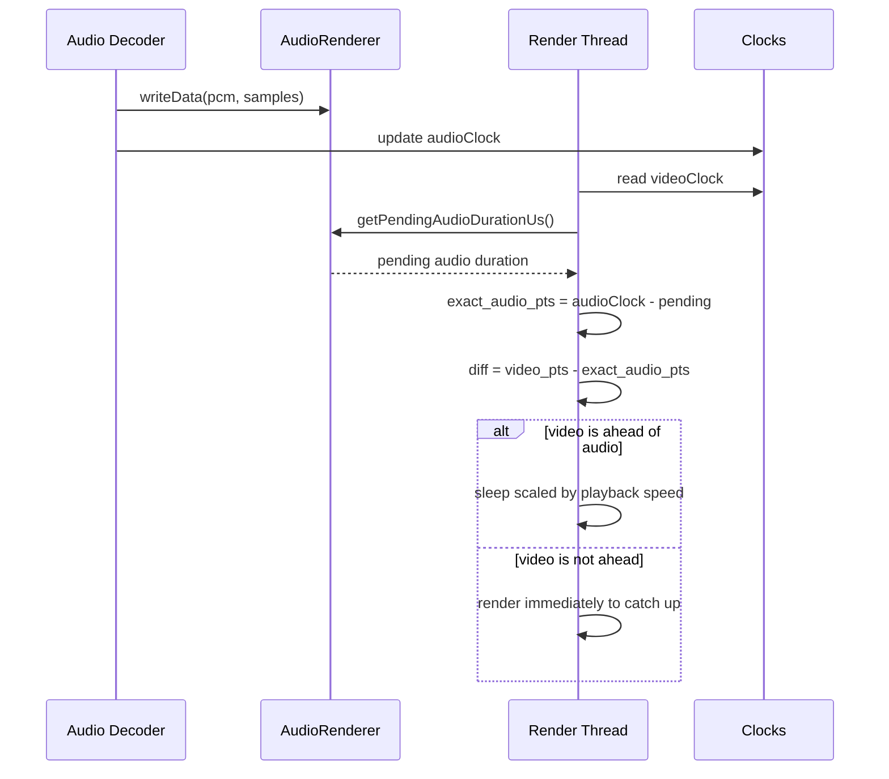
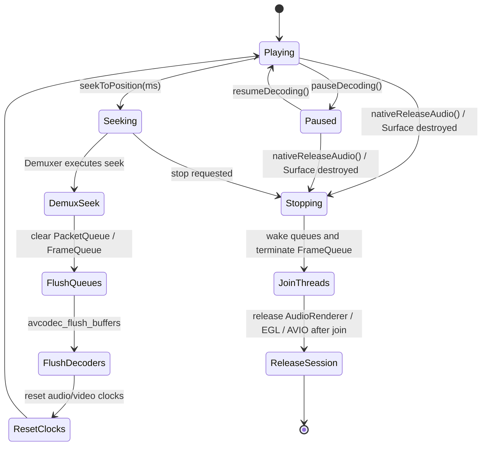
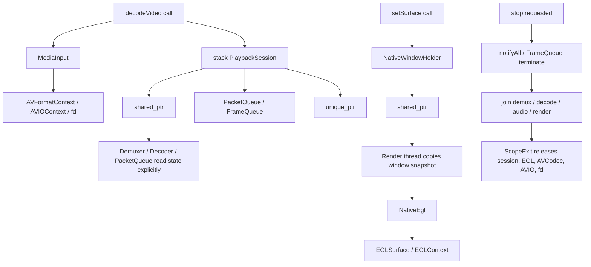
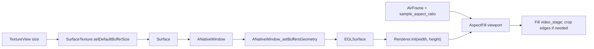

# VideoDecoder

**English** | [中文](README.zh-CN.md)

VideoDecoder is a native Android playback experiment built with **Android + JNI + FFmpeg + OpenGL ES + AAudio**. Instead of wrapping the system media player, it separates demuxing, audio/video decoding, audio output, OpenGL rendering, playback control, and UI interaction into an observable and debuggable native playback pipeline.

---

## Multi-Agent Evolution System

This project is evolved through a multi-agent, cross-domain full-stack workflow designed for mixed technology stacks. The system bridges low-level C++ cross-compilation, strict `arm64-v8a` native builds, multi-threaded `FFmpeg` packet/frame queues, `OpenGL / AAudio` clock-sensitive playback, and modern `Jetpack Compose` UI with dynamic shader lighting and Liquid Glass interaction.

The workflow relies on long-chain reasoning across layers. A frontend agent analyzes open-source motion libraries, spatial math, spring damping, refraction, highlights, and gesture deformation. A cross-stack agent traces JNI state locks, native playback clocks, async queues, seek wakeups, EGL surfaces, and the rendering pipeline. When the input is an ambiguous perceptual issue such as "speed switching feels abrupt", "dragging stalls", "there is too much black area", or "the button does not feel like liquid glass", the system can trace from Compose `Spring` behavior and gesture state all the way down to native queues, Surface lifecycle, OpenGL viewport logic, and AAudio sync.

This turns cross-environment code edits, NDK build-chain adaptation, Gradle validation, and UI feel iteration into a tight engineering loop, compressing work that would normally require repeated senior full-stack debugging into fast, minutes-level iterations.

---

## Core Capabilities

- Local video selection and playback.
- FFmpeg demuxing and software decoding for audio and video streams.
- OpenGL ES YUV frame rendering to Android Surface.
- Visible playback surface migrated to `TextureView`, with `SurfaceTexture` buffer size synchronized to the UI window.
- Low-latency audio output through AAudio.
- Play, pause, resume, seek, and playback speed control.
- Speed changes through FFmpeg `atempo`, preserving pitch while changing playback rate.
- Native playback progress polling and seek through the progress bar.
- Modern **Liquid Glass** interaction built with Jetpack Compose and AndroidLiquidGlass.
- Four-zone player layout: top text/status area, video area, progress area, and button area.
- Liquid Glass progress slider with drag deformation, release-to-seek, and stable drag-state cleanup.
- Select, decode, play, and pause buttons use AndroidLiquidGlass-style physical drag deformation, elastic rebound, and real backdrop refraction.
- Speed tabs use a bright translucent glass container with a liquid indicator and drag-to-change interaction.

---

## Architecture

The project uses a **Java UI layer + Native media core** architecture. Java handles UI, file selection, and user interaction. C++ handles media processing, thread orchestration, synchronization, and rendering.



---

## Liquid Glass UI Modernization

The project integrates the AndroidLiquidGlass style to create an iOS/visionOS-like liquid glass player interface.

### Integration Points

1. **Hybrid Layout Architecture**
   - `activity_main.xml` keeps the required legacy View IDs so Java can reuse event, state, and JNI wiring.
   - The video area uses `TextureView` for the native rendering Surface.
   - `ComposeView` is a full-screen Liquid Glass overlay that draws the top information area, progress area, and button area.
   - The visible layout is organized into four stable zones: top text/status, video, progress, and controls.
   - Hidden legacy controls have been fully removed; the Compose overlay is now the sole UI layer for playback controls, calling JNI methods directly through `LiquidActions`.

2. **Liquid Glass Interaction**
   - `LiquidControls.kt`: Compose Liquid Glass panels and buttons based on `rememberLayerBackdrop()` and `drawBackdrop`.
   - `LiquidSlider.kt`: Liquid Glass progress slider with direct drag tracking and release-to-seek.
   - `DampedDragAnimation.kt`: drag deformation, press/release animation, cancellation of stale value animations, and stable cleanup during long drags.
   - `InteractiveHighlight.kt`: press highlights and elastic deformation using nonlinear displacement and direction-aware scaling.
   - `DragGestureInspector.kt`: shared gesture parsing utilities.

3. **Visual Consistency**
   - Top status panel, progress panel, and button panel share the same Liquid Glass visual language.
   - Select, decode, play/pause, and speed controls use transparent glass styling instead of strong red/blue tint blocks.
   - The background uses `wallpaper_light.webp` from AndroidLiquidGlass as the root/window background with edge-to-edge window rendering.
   - The Compose overlay records the same wallpaper into a `LayerBackdrop` source around the video region, so buttons and panels refract real background pixels instead of a transparent layer.
   - Playback state is synchronized through `LiquidGlassHelper` and reflected in button activity and status text.
   - Active decode/playing/pause button text and speed tab state use accent blue (`#0091FF` / system-blue variants) instead of plain white.

4. **Ripple Effect** (`Ripple.kt`)
   - Custom `glassRipple()` with reduced alpha values (pressed 0.1, dragged 0.16, hovered 0.08) for a subtler glass feel.
   - Uses `createRippleModifierNode` from `androidx.compose.material.ripple`.

5. **Parameter Alignment with AndroidLiquidGlass Catalog**
   - `LiquidSlider.kt`: thumb 40×24dp, track 6dp, shadow alpha 0.05f.
   - `LiquidButton`: restores the catalog-style `InteractiveHighlight.gestureModifier` path so finger movement drives nonlinear displacement, stretch, and rebound.
   - `SpeedBottomTabs`: container 64dp, pressedScale 78/56, indicator highlight/shadow alpha follows `progress`, with a bright translucent glass surface and subtle Plus-mode sheen.
   - Invisible tab layer retains `layerBackdrop` capture with `ColorFilter.tint(accentColor)` for indicator backdrop.

6. **Edge-to-Edge Window**
   - `configureEdgeToEdgeWindow()` sets transparent status/navigation bars with `LAYOUT_STABLE | LAYOUT_FULLSCREEN | LAYOUT_HIDE_NAVIGATION`.
   - `applySystemBarInsets()` applies system bar insets to `player_content` so content is properly positioned below system bars.
   - Theme enforces `enforceStatusBarContrast=false` and `enforceNavigationBarContrast=false` to prevent system from drawing opaque bar backgrounds.
   - The former gray strip at the top of the wallpaper was caused by Android drawing a separate opaque status-bar background over the page, not by the wallpaper image.
   - The fix keeps the wallpaper edge-to-edge while adding status-bar spacing back to View and Compose content (`player_content` and `WindowInsets.statusBars`), so controls stay below system icons.

### File Map

```text
app/
├─ src/main/java/com/example/videodecoder/
│  ├─ MainActivity.java              # Java entry, TextureView, JNI calls, edge-to-edge, state sync
│  ├─ LiquidControls.kt              # Compose Liquid Glass panels and buttons
│  ├─ LiquidSlider.kt                # Liquid Glass progress slider
│  ├─ DampedDragAnimation.kt         # Drag deformation and release animation
│  ├─ LiquidGlassHelper.kt           # Java -> Compose state bridge
│  ├─ InteractiveHighlight.kt        # Press highlight and elastic deformation
│  ├─ DragGestureInspector.kt        # Gesture parser
│  ├─ Ripple.kt                      # Custom glass ripple with reduced alpha
│  ├─ UISensor.kt                    # Accelerometer-driven lighting angle with threshold filter
│  ├─ PlaybackInputPolicy.java
│  ├─ PlaybackTimeFormatter.java
│  └─ PlaybackUiPolicy.java
├─ src/main/res/layout/
│  └─ activity_main.xml              # Four-zone layout skeleton and ComposeView container
├─ src/main/res/drawable/
│  ├─ wallpaper_light.webp           # Light gradient wallpaper background
│  ├─ bg_deadliner_surface.xml
│  ├─ bg_deadliner_chip.xml
│  └─ bg_liquid_player_surface.xml   # Legacy dark player background
└─ src/main/cpp/
   ├─ native-lib.cpp
   ├─ MediaInput.cpp/.h
   ├─ NativeEgl.cpp/.h
   ├─ NativeWindowHolder.cpp/.h
   ├─ ScopeExit.h
   ├─ JniStringChars.h
   ├─ Demuxer.cpp/.h
   ├─ Decoder.cpp/.h
   ├─ queue.cpp/.h
   ├─ videoRender.cpp/.h
   └─ AudioRender.cpp/.h
```

---

## Liquid Glass Performance Optimizations

The liquid glass UI renders multiple backdrop panels with blur, lens refraction, vibrancy, highlights, shadows, and animated shaders. The following optimizations reduce per-frame GPU and recomposition overhead to keep the interface smooth:

1. **Sensor-driven recomposition throttling** (`UISensor.kt`)
   - Accelerometer updates arrive at ~60 Hz and previously triggered full overlay recomposition every frame.
   - A 2-degree angle threshold filters sub-threshold changes; internal smoothing continues but Compose state only updates on meaningful orientation shifts.

2. **Gesture animation cancellation** (`DampedDragAnimation.kt`)
   - Progress dragging previously risked accumulating value animations during long touch sessions.
   - The current animation controller cancels stale value/press jobs, keeps only the latest drag target, and releases deterministically.

3. **Backdrop source scoping** (`LiquidControls.kt`)
   - AndroidLiquidGlass effects need a Compose-recorded backdrop source; XML-only backgrounds are not enough for real lens sampling.
   - The overlay records `wallpaper_light.webp` into a `LayerBackdrop` around the video region, giving glass controls real pixels while avoiding a wallpaper layer over the native video surface.

4. **Single-pass highlight shader** (`InteractiveHighlight.kt`)
   - Button highlights now use one radial shader pass driven by the actual gesture position.
   - The same state drives nonlinear displacement, stretch, and release instead of running a separate decorative trail animation.

---

## Build Requirements

- Android Studio or command-line Gradle.
- Android SDK 36.
- Kotlin 2.3.10.
- Android NDK + CMake.
- Java 11.
- Gradle Wrapper from this repository: `gradlew` / `gradlew.bat`.

### Windows

```powershell
.\gradlew.bat clean
.\gradlew.bat assembleDebug
```

### Unix/macOS

```bash
./gradlew clean
./gradlew assembleDebug
```

---

## Platform Limitation

The project currently supports **`arm64-v8a` only**:

- `app/build.gradle` fixes `abiFilters "arm64-v8a"`.
- The prebuilt FFmpeg library is located at `app/src/main/jniLibs/arm64-v8a/libffmpeg.so`.
- Do **not** test on x86/x86_64 emulators, because the native FFmpeg library will not be found or loaded.
- Use an arm64 device or compatible arm64 environment for playback validation.

---

## Playback Thread Model

Playback starts four major native threads:

1. **Demux thread**: reads packets through `av_read_frame` and dispatches them to audio/video `PacketQueue`.
2. **Video decode thread**: decodes video packets, converts frames to tightly packed `YUV420P` with `sws_scale`, and pushes frames into `FrameQueue`.
3. **Audio decode thread**: decodes audio packets, resamples to S16 with `Swr`, applies `atempo` for speed control, and writes to AAudio.
4. **Render thread**: reads frames from `FrameQueue`, synchronizes against the audio clock, uploads YUV textures, and calls `eglSwapBuffers`.



`PacketQueue` and `FrameQueue` both apply backpressure to prevent demux/decode from growing memory without bounds. Seek and stop paths clear queues and wake waiting threads so playback can recover or exit.

---

## Audio/Video Synchronization

The current sync strategy uses audio playback progress as the main reference. The render thread estimates the real audio position by subtracting the pending AAudio/software queue duration from the latest submitted audio PTS:

```cpp
exact_audio_pts = audioClock - pending_audio_duration
diff = video_pts - exact_audio_pts
```



- `diff > 0`: video is ahead, so the render thread sleeps briefly.
- `diff <= 0`: video renders immediately and catches up to audio.
- During speed playback, video wait duration is scaled by `playbackSpeed`, while audio timing is adjusted through `atempo`.

---

## Seek and Playback Control

Seek uses a two-stage handshake:

1. Java calls `seekToPosition(ms)`.
2. Native stores the target time and sets `isSeeking = true`.
3. Demuxer runs `avformat_seek_file`, falling back to `av_seek_frame` if needed.
4. Old packet/frame queues are cleared, decoders are flushed, audio buffers are rebuilt, and clocks are reset.
5. Seek state is cleared and playback resumes.



`PacketQueue::push()` now wakes periodically while full and checks `isSeeking`, allowing seek requests to interrupt a full queue instead of waiting for another user interaction.

---

## Native Resource Ownership



---

## Video Window Adaptation

The video window now prioritizes filling the player area while preserving the video aspect ratio.



---

## Legacy UI Decoupling

The project previously used a hybrid approach where a full set of hidden legacy View controls (`SeekBar`, `MaterialButton`s, `MaterialCardView`s) existed in `activity_main.xml` with `visibility="gone"` and `1dp x 1dp` dimensions. The Compose Liquid Glass overlay duplicated all playback controls but still dispatched events through `performClick()` on these hidden views.

This coupling has been removed:

- **`activity_main.xml`**: The entire `legacy_controls` LinearLayout (containing hidden `seek_bar`, `play_button`, `pause_button`, `select_video_button`, `decode_video_button`, speed buttons, and associated cards) has been removed.
- **`MainActivity.java`**: 14 hidden control member variables, their `findViewById` bindings, and click listeners have been removed. The `LiquidActions` implementation now calls business logic directly (`pickVideo()`, `startDecode()`, `resumeDecoding()`, `pauseDecoding()`, `applyPlaybackSpeed()`, `seekToPosition()`) instead of routing through `performClick()` on hidden buttons.
- **State management**: `setPlaybackUiState()` and `updateUiStateColorScheme()` no longer apply fade/tint to hidden controls; they only update the visible header chips and sync state to Compose via `LiquidGlassHelper`.
- **Progress tracking**: `updateProgress()` now only calls `LiquidGlassHelper.setProgress()`, delegating time display entirely to the Compose layer.
- **Entrance animations**: `startEntranceAnimations()` simplified to only animate the visible `header_card`.
- **Dead code removed**: `applyButtonTint()`, `applyControlFade()`, `applyViewFade()`, `updateTimeText()`, and associated member variables (`hasUiStateApplied`, `isSeeking`, `seekBar`, etc.) have been removed.
- **New method**: `startDecode()` extracts the decode orchestration logic previously embedded in the hidden decode button's click listener.

---

## Compose Sole UI Layer Migration

Following the legacy UI decoupling, the remaining invisible View widgets have been removed to make Compose the true sole UI layer:

- **`activity_main.xml`**: Removed the `header_card` MaterialCardView (containing `header_status_chip`, `preview_status_chip`, and `sample_text` TextViews). A 96dp spacer View is added to maintain the video area positioning expected by the Compose overlay.
- **`MainActivity.java`**: Removed all remaining invisible View member variables (`tv`, `headerStatusChip`, `previewStatusChip`, `headerCard`, `selectedSpeed`, `entranceInterpolator`). Removed `findViewById` bindings, `setVisibility(INVISIBLE)` calls, and fade animations on invisible views.
- **State management simplified**: `updateUiStateColorScheme()`, `resolveStateColorScheme()`, `resolveColor()`, and the `StateColorScheme` class have been entirely removed. `setPlaybackUiState()` now only syncs state to Compose via `LiquidGlassHelper`.
- **`setStatusTextWithFade()`** simplified to a single `LiquidGlassHelper.setStatusText()` call.
- **`onVideoDecoded()`** no longer calls `tv.append()`; status text is updated through `LiquidGlassHelper`.
- **Dead code removed**: `startEntranceAnimations()`, `animateEntrance()`, `dpToPx()`, and all associated unused imports (`ColorStateList`, `AccelerateDecelerateInterpolator`, `TextView`, `MaterialCardView`, `ContextCompat`).
- **Build config**: Removed unused `viewBinding true` from `app/build.gradle`.
- **Deprecated API**: Added `@SuppressWarnings("deprecation")` to `configureEdgeToEdgeWindow()` for the pre-API-30 `getSystemUiVisibility()` fallback path.

### Seek Synchronization Improvement

The audio decode thread's seek synchronization has been improved from a busy-wait polling pattern to a proper condition variable mechanism:

- **`PlaybackState.h`**: Added `std::mutex seekMutex`, `std::condition_variable seekCv`, `notifySeekApplied()`, and `waitForSeekApplied(timeoutMs)` methods.
- **`native-lib.cpp`**: The audio decode thread now calls `state->waitForSeekApplied(1000)` instead of sleeping 1ms per loop for up to 1000 iterations. The condition variable also wakes on `stopRequested`, ensuring clean shutdown.
- **`Demuxer.cpp`**: After setting `seekApplied = true`, calls `state->notifySeekApplied()` to wake waiting threads.
- **`native-lib.cpp` (render thread)**: The abort handler also calls `notifySeekApplied()` to unblock the audio thread on render failure.

---

## Recent Stability Improvements

- Render initialization failures set stop flags, wake packet queues, and terminate `FrameQueue`.
- `AudioRenderer` ownership is scoped inside `PlaybackSession`, avoiding cross-session raw pointer risks.
- `FrameQueue::clear()` notifies waiting threads after clearing.
- Video decode no longer assumes source frames are tightly packed `YUV420P`; frames are converted through `sws_scale`.
- U/V planes are uploaded with `(width + 1) / 2` and `(height + 1) / 2`, supporting odd frame sizes.
- Debug YUV export is opt-in to reduce I/O and storage pressure.
- Native windows are held through shared handles in `NativeWindowHolder`; render threads use snapshots to avoid stale global window access.
- EGL display, surface, and context setup/cleanup are extracted into `NativeEgl`.
- Visible rendering moved to `TextureView`, with SurfaceTexture buffer sizing kept in sync.
- OpenGL viewport uses `AspectFill / CenterCrop` to reduce black borders.
- Liquid slider drag uses a 40dp touch target, freezes external progress sync while interacting, cancels stale value animations, and releases deterministically.
- Select/decode/play/pause buttons restore AndroidLiquidGlass physical drag: finger-position highlight, nonlinear displacement, stretch, and elastic rebound.
- The Compose overlay records the wallpaper into `LayerBackdrop` around the video window, giving Liquid Glass controls real background pixels for blur/lens refraction.
- Speed tabs use a bright translucent glass container and a subtle blue-accented liquid indicator instead of a dark tinted panel.
- `PacketQueue::push()` periodically checks seek state while blocked by queue backpressure.

---

## UI Design and Interaction

- **Four-zone layout**: top text/status, video, progress, and button control areas.
- **Edge-to-edge window**: transparent status/navigation bars with system bar inset handling; `enforceStatusBarContrast=false` prevents opaque system bar backgrounds.
- **Wallpaper background**: `wallpaper_light.webp` from AndroidLiquidGlass as full-screen page background.
- **Top gray strip fix**: the wallpaper now renders behind the status bar; system bar insets are applied to content instead of letting Android fill the status bar with a separate gray theme color.
- **Top information panel**: Liquid Glass surface synchronized through `LiquidGlassHelper.setStatusText()`.
- **Progress placement**: progress stays close to the video area; buttons stay close to progress.
- **Unified transparent glass controls**: select, decode, play/pause, and speed controls share the same backdrop language.
- **Physical button interaction**: select, decode, play, and pause buttons keep the AndroidLiquidGlass drag/rebound model, with click pulse only as a short-tap fallback.
- **Real backdrop sampling**: Compose records the wallpaper backdrop around the video window so glass blur and lens effects scatter actual background pixels.
- **State linkage**: `MainActivity` maps playback state to chips, button activity, progress, and Compose state. (Note: after legacy control removal, button and SeekBar linkage is handled by the Compose layer; `MainActivity` only manages header chip colors and `LiquidGlassHelper` state sync.)
- **Motion rhythm**: entrance and state transitions use subtle fade/slide animation; drag controls use spring release and elastic cleanup.
- **Visual parameter alignment**: slider thumb 40×24dp, track 6dp; speed tabs container 64dp, indicator alpha follows press progress with a bright glass surface.
- **Custom ripple**: `glassRipple()` with reduced alpha for subtler glass feedback.

---

## Build Validation

```powershell
.\gradlew.bat assembleDebug
.\gradlew.bat testDebugUnitTest
```

---

## JNI API

- `decodeVideo(String videoPath, String outputPath)`
- `setSurface(Surface surface)`
- `pauseDecoding()`
- `resumeDecoding()`
- `setPlaybackSpeed(float speed)`
- `seekToPosition(int progressMs)`
- `getDurationMs()`
- `getCurrentPositionMs()`
- `nativeReleaseAudio()`

---

## Known Limitations and Future Work

- Video input uses native custom AVIO over an authorized file descriptor. Seek may be limited if a content provider returns a non-seekable fd.
- YUV export remains as a native debug capability and is disabled by default in normal UI playback.
- End-to-end testing should focus on continuous seek, speed switching, Surface destruction/recreation, and long video playback on arm64 devices.
- `native-lib.cpp` still carries JNI, thread orchestration, synchronization, and resource cleanup responsibilities; it can be further split into dedicated session/controller modules.

---

## Acknowledgements

- **FFmpeg**
- **Android NDK**
- **AndroidLiquidGlass**
- **Jetpack Compose**
