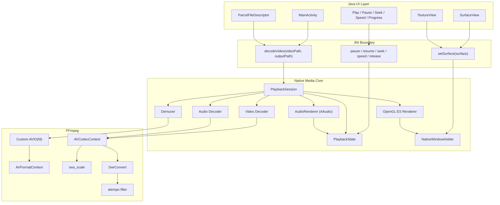
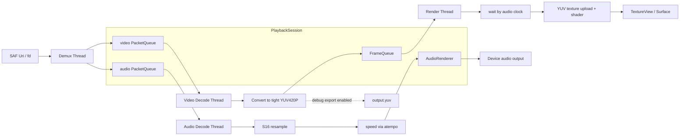
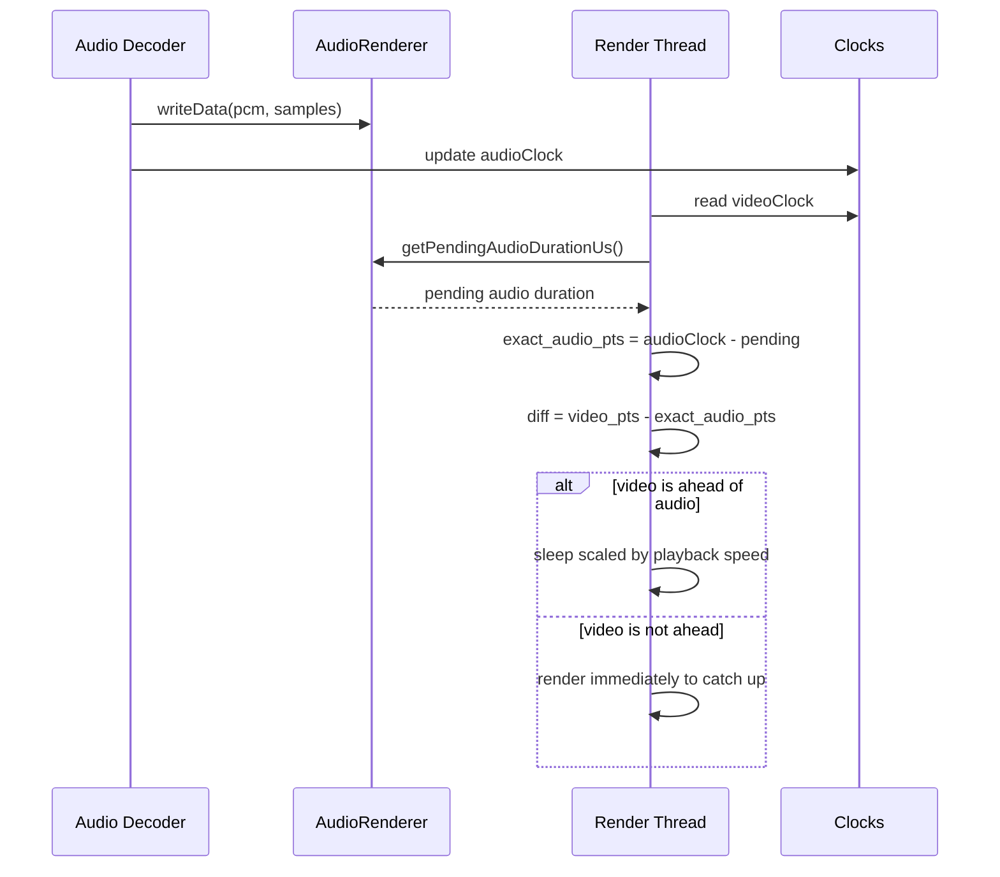
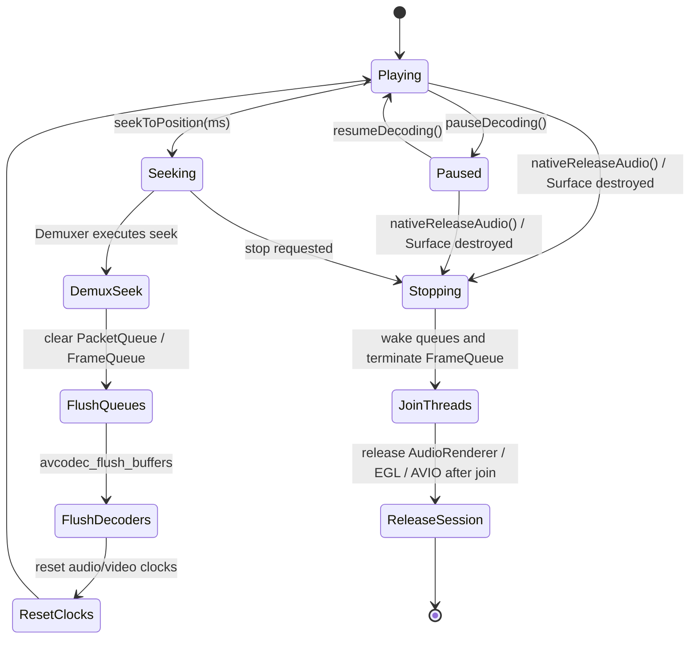
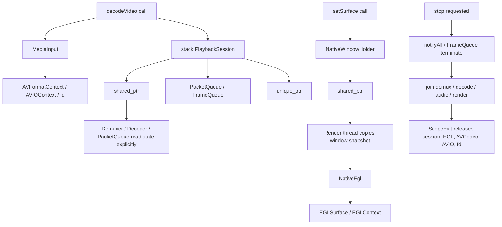
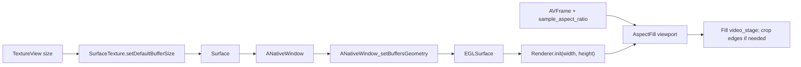

# VideoDecoder

**English** | [中文](README.zh-CN.md)

VideoDecoder is a native Android playback experiment built with **Android + JNI + FFmpeg + OpenGL ES + AAudio**. Instead of wrapping the system media player, it separates demuxing, audio/video decoding, audio output, OpenGL rendering, playback control, and UI interaction into an observable and debuggable native playback pipeline.

---

## Multi-Agent Evolution System

This project is evolved through a multi-agent, cross-domain full-stack workflow designed for mixed technology stacks. The system bridges low-level C++ cross-compilation, strict `arm64-v8a` native builds, multi-threaded `FFmpeg` packet/frame queues, `OpenGL / AAudio` clock-sensitive playback, and modern `Jetpack Compose` UI with dynamic shader lighting and Liquid Glass interaction.

The workflow relies on long-chain reasoning across layers. A frontend agent analyzes open-source motion libraries, spatial math, spring damping, refraction, highlights, and gesture deformation. A cross-stack agent traces JNI state locks, native playback clocks, async queues, seek wakeups, EGL surfaces, and the rendering pipeline. When the input is an ambiguous perceptual issue such as "speed switching feels abrupt", "dragging stalls", "there is too much black area", or "the button does not feel like liquid glass", the system can trace from Compose `Spring` behavior and gesture state all the way down to native queues, Surface lifecycle, OpenGL viewport logic, and AAudio sync.

This turns cross-environment code edits, NDK build-chain adaptation, Gradle validation, and UI feel iteration into a tight engineering loop, compressing work that would normally require repeated senior full-stack debugging into fast, minutes-level iterations.

---

## Core Capabilities

- Local video selection and playback.
- FFmpeg demuxing and software decoding for audio and video streams.
- OpenGL ES YUV frame rendering to Android Surface.
- Visible playback surface migrated to `TextureView`, with `SurfaceTexture` buffer size synchronized to the UI window.
- Low-latency audio output through AAudio.
- Play, pause, resume, seek, and playback speed control.
- Speed changes through FFmpeg `atempo`, preserving pitch while changing playback rate.
- Native playback progress polling and seek through the progress bar.
- Modern **Liquid Glass** interaction built with Jetpack Compose and AndroidLiquidGlass.
- Four-zone player layout: top text/status area, video area, progress area, and button area.
- Liquid Glass progress slider with drag deformation, release-to-seek, and stable drag-state cleanup.

---

## Architecture

The project uses a **Java UI layer + Native media core** architecture. Java handles UI, file selection, and user interaction. C++ handles media processing, thread orchestration, synchronization, and rendering.



---

## Liquid Glass UI Modernization

The project integrates the AndroidLiquidGlass style to create an iOS/visionOS-like liquid glass player interface.

### Integration Points

1. **Hybrid Layout Architecture**
   - `activity_main.xml` keeps the required legacy View IDs so Java can reuse event, state, and JNI wiring.
   - The video area uses `TextureView` for the native rendering Surface.
   - `ComposeView` is a full-screen Liquid Glass overlay that draws the top information area, progress area, and button area.
   - The visible layout is organized into four stable zones: top text/status, video, progress, and controls.

2. **Liquid Glass Interaction**
   - `LiquidControls.kt`: Compose Liquid Glass panels and buttons based on `rememberLayerBackdrop()` and `drawBackdrop`.
   - `LiquidSlider.kt`: Liquid Glass progress slider with direct drag tracking and release-to-seek.
   - `DampedDragAnimation.kt`: drag deformation, press/release animation, and stable cleanup.
   - `InteractiveHighlight.kt`: press highlights, drag trail, and elastic deformation using nonlinear displacement and direction-aware scaling.
   - `DragGestureInspector.kt`: shared gesture parsing utilities.

3. **Visual Consistency**
   - Top status panel, progress panel, and button panel share the same Liquid Glass visual language.
   - Select, decode, play/pause, and speed controls use transparent glass styling instead of strong red/blue tint blocks.
   - The background is a dark player surface to keep white text and glass controls readable.
   - Playback state is synchronized through `LiquidGlassHelper` and reflected in button activity and status text.

### File Map

```text
app/
├─ src/main/java/com/example/videodecoder/
│  ├─ MainActivity.java              # Java entry, TextureView, JNI calls, state sync
│  ├─ LiquidControls.kt              # Compose Liquid Glass panels and buttons
│  ├─ LiquidSlider.kt                # Liquid Glass progress slider
│  ├─ DampedDragAnimation.kt         # Drag deformation and release animation
│  ├─ LiquidGlassHelper.kt           # Java -> Compose state bridge
│  ├─ InteractiveHighlight.kt        # Press highlight and elastic deformation
│  ├─ DragGestureInspector.kt        # Gesture parser
│  ├─ PlaybackInputPolicy.java
│  ├─ PlaybackTimeFormatter.java
│  └─ PlaybackUiPolicy.java
├─ src/main/res/layout/
│  └─ activity_main.xml              # Four-zone layout skeleton and ComposeView container
├─ src/main/res/drawable/
│  ├─ bg_deadliner_surface.xml
│  ├─ bg_deadliner_chip.xml
│  └─ bg_liquid_player_surface.xml   # Dark player background
└─ src/main/cpp/
   ├─ native-lib.cpp
   ├─ MediaInput.cpp/.h
   ├─ NativeEgl.cpp/.h
   ├─ NativeWindowHolder.cpp/.h
   ├─ ScopeExit.h
   ├─ JniStringChars.h
   ├─ Demuxer.cpp/.h
   ├─ Decoder.cpp/.h
   ├─ queue.cpp/.h
   ├─ videoRender.cpp/.h
   └─ AudioRender.cpp/.h
```

---

## Build Requirements

- Android Studio or command-line Gradle.
- Android SDK 36.
- Kotlin 2.3.10.
- Android NDK + CMake.
- Java 11.
- Gradle Wrapper from this repository: `gradlew` / `gradlew.bat`.

### Windows

```powershell
.\gradlew.bat clean
.\gradlew.bat assembleDebug
```

### Unix/macOS

```bash
./gradlew clean
./gradlew assembleDebug
```

---

## Platform Limitation

The project currently supports **`arm64-v8a` only**:

- `app/build.gradle` fixes `abiFilters "arm64-v8a"`.
- The prebuilt FFmpeg library is located at `app/src/main/jniLibs/arm64-v8a/libffmpeg.so`.
- Do **not** test on x86/x86_64 emulators, because the native FFmpeg library will not be found or loaded.
- Use an arm64 device or compatible arm64 environment for playback validation.

---

## Playback Thread Model

Playback starts four major native threads:

1. **Demux thread**: reads packets through `av_read_frame` and dispatches them to audio/video `PacketQueue`.
2. **Video decode thread**: decodes video packets, converts frames to tightly packed `YUV420P` with `sws_scale`, and pushes frames into `FrameQueue`.
3. **Audio decode thread**: decodes audio packets, resamples to S16 with `Swr`, applies `atempo` for speed control, and writes to AAudio.
4. **Render thread**: reads frames from `FrameQueue`, synchronizes against the audio clock, uploads YUV textures, and calls `eglSwapBuffers`.



`PacketQueue` and `FrameQueue` both apply backpressure to prevent demux/decode from growing memory without bounds. Seek and stop paths clear queues and wake waiting threads so playback can recover or exit.

---

## Audio/Video Synchronization

The current sync strategy uses audio playback progress as the main reference. The render thread estimates the real audio position by subtracting the pending AAudio/software queue duration from the latest submitted audio PTS:

```cpp
exact_audio_pts = audioClock - pending_audio_duration
diff = video_pts - exact_audio_pts
```



- `diff > 0`: video is ahead, so the render thread sleeps briefly.
- `diff <= 0`: video renders immediately and catches up to audio.
- During speed playback, video wait duration is scaled by `playbackSpeed`, while audio timing is adjusted through `atempo`.

---

## Seek and Playback Control

Seek uses a two-stage handshake:

1. Java calls `seekToPosition(ms)`.
2. Native stores the target time and sets `isSeeking = true`.
3. Demuxer runs `avformat_seek_file`, falling back to `av_seek_frame` if needed.
4. Old packet/frame queues are cleared, decoders are flushed, audio buffers are rebuilt, and clocks are reset.
5. Seek state is cleared and playback resumes.



`PacketQueue::push()` now wakes periodically while full and checks `isSeeking`, allowing seek requests to interrupt a full queue instead of waiting for another user interaction.

---

## Native Resource Ownership



---

## Video Window Adaptation

The video window now prioritizes filling the player area while preserving the video aspect ratio.



---

## Recent Stability Improvements

- Render initialization failures set stop flags, wake packet queues, and terminate `FrameQueue`.
- `AudioRenderer` ownership is scoped inside `PlaybackSession`, avoiding cross-session raw pointer risks.
- `FrameQueue::clear()` notifies waiting threads after clearing.
- Video decode no longer assumes source frames are tightly packed `YUV420P`; frames are converted through `sws_scale`.
- U/V planes are uploaded with `(width + 1) / 2` and `(height + 1) / 2`, supporting odd frame sizes.
- Debug YUV export is opt-in to reduce I/O and storage pressure.
- Native windows are held through shared handles in `NativeWindowHolder`; render threads use snapshots to avoid stale global window access.
- EGL display, surface, and context setup/cleanup are extracted into `NativeEgl`.
- Visible rendering moved to `TextureView`, with SurfaceTexture buffer sizing kept in sync.
- OpenGL viewport uses `AspectFill / CenterCrop` to reduce black borders.
- Liquid slider drag now snaps while dragging and releases deterministically.
- `PacketQueue::push()` periodically checks seek state while blocked by queue backpressure.

---

## UI Design and Interaction

- **Four-zone layout**: top text/status, video, progress, and button control areas.
- **Top information panel**: Liquid Glass surface synchronized through `LiquidGlassHelper.setStatusText()`.
- **Progress placement**: progress stays close to the video area; buttons stay close to progress.
- **Unified transparent glass controls**: select, decode, play/pause, and speed controls share the same backdrop language.
- **State linkage**: `MainActivity` maps playback state to chips, button activity, progress, and Compose state.
- **Motion rhythm**: entrance and state transitions use subtle fade/slide animation; active buttons use lightweight breathing motion.

---

## Build Validation

```powershell
.\gradlew.bat assembleDebug
.\gradlew.bat testDebugUnitTest
```

---

## JNI API

- `decodeVideo(String videoPath, String outputPath)`
- `setSurface(Surface surface)`
- `pauseDecoding()`
- `resumeDecoding()`
- `setPlaybackSpeed(float speed)`
- `seekToPosition(int progressMs)`
- `getDurationMs()`
- `getCurrentPositionMs()`
- `nativeReleaseAudio()`

---

## Known Limitations and Future Work

- Video input uses native custom AVIO over an authorized file descriptor. Seek may be limited if a content provider returns a non-seekable fd.
- YUV export remains as a native debug capability and is disabled by default in normal UI playback.
- End-to-end testing should focus on continuous seek, speed switching, Surface destruction/recreation, and long video playback on arm64 devices.
- `native-lib.cpp` still carries JNI, thread orchestration, synchronization, and resource cleanup responsibilities; it can be further split into dedicated session/controller modules.

---

## Acknowledgements

- **FFmpeg**
- **Android NDK**
- **AndroidLiquidGlass**
- **Jetpack Compose**
