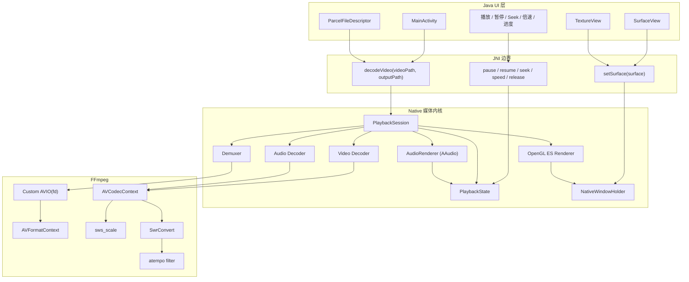
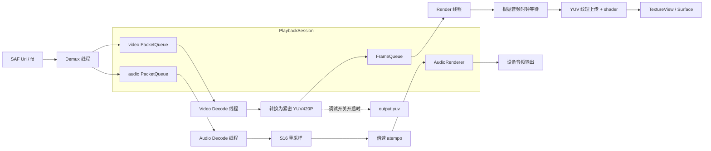
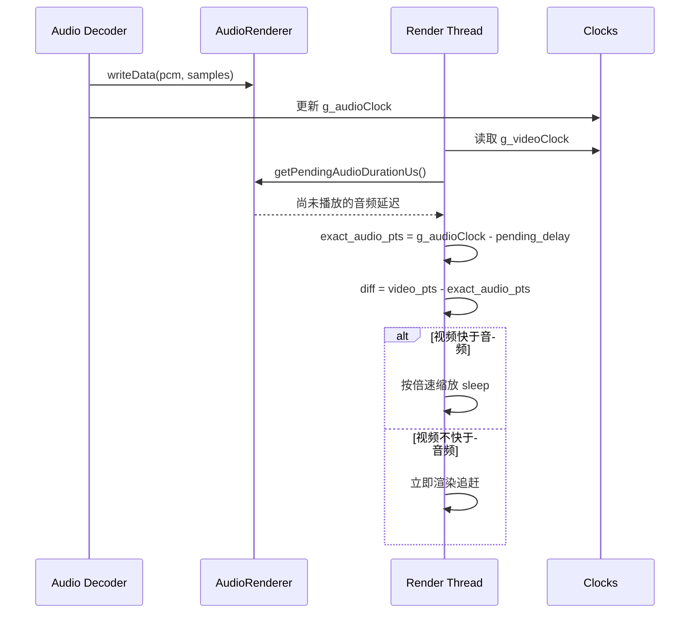
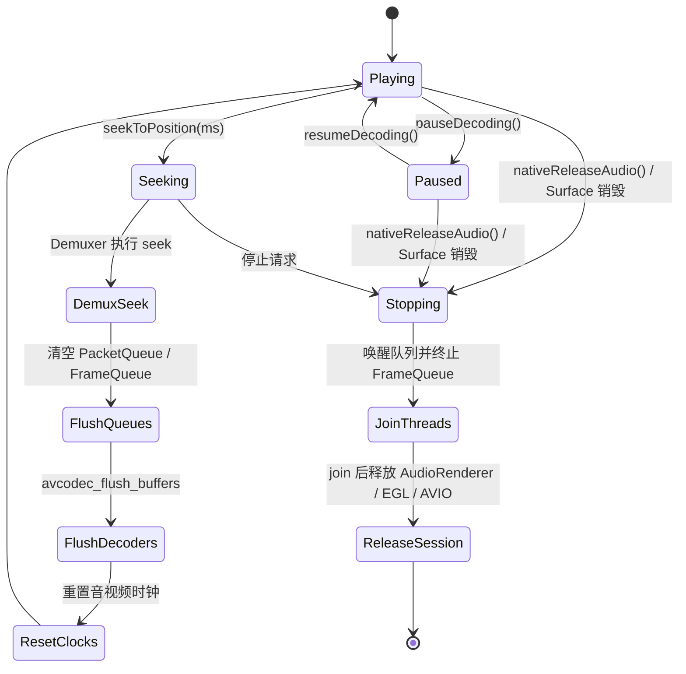
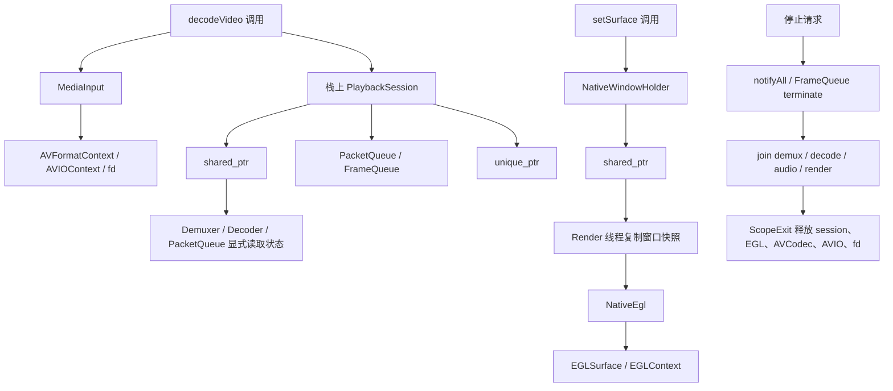
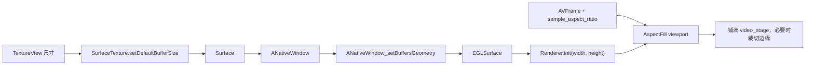

# VideoDecoder

[English](README.md) | **中文**

VideoDecoder 是一个基于 **Android + JNI + FFmpeg + OpenGL ES + AAudio** 的原生播放器实验项目。它的重点不是封装系统播放器，而是把解复用、音视频解码、音频输出、OpenGL 渲染和播放控制拆开，形成一条可观察、可调试、可继续演进的 native 播放链路。


---

## 多 Agent 协作演进系统

本项目的演进过程由一个多 Agent 协作驱动的跨域全栈系统支撑，目标是解决割裂技术栈下的架构协同难题：从底层 C++ 交叉编译、严格面向 `arm64-v8a` 的硬件级构建、多线程 `FFmpeg` 帧队列解析、`OpenGL / AAudio` 强时钟同步，到表层 `Jetpack Compose` UI、动态 Shader 光影和 Liquid Glass 流体玻璃质感，系统将这些原本相互割裂的技术层打通为一条可连续推理、修改和验证的工程链路。

在核心逻辑流上，系统依赖长链推理和跨栈追踪能力：前端 Agent 负责拆解开源动效库，分析其空间数学模型、弹性阻尼、光影折射和交互形变；跨栈 Agent 则深入 JNI 状态锁、native 播放时钟、异步队列消费、seek 唤醒和 EGL 渲染流水线。当接收到“倍速切换生硬”“拖拽阻滞”“视频黑边过大”“按钮不像液态玻璃”等模糊体感反馈时，系统会从顶层 Compose `Spring` 阻尼、gesture 状态机和 backdrop 渲染，一路追踪到底层 native 队列、Surface 生命周期、OpenGL viewport 和 AAudio 时钟同步，完成对齐调优。

这套协作方式把跨环境代码修改、NDK 构建链适配、Gradle 构建验证和 UI 体感迭代组织成闭环，使原本需要资深全栈架构师反复试错的 Android mixed-stack 开发流程，压缩为可快速迭代的分钟级工程演进过程。


---

## 核心能力

- 本地视频文件选择与播放
- FFmpeg 解复用与软解码，支持音频和视频流
- OpenGL ES 将 YUV 视频帧渲染到 `SurfaceView`
- 当前可见播放窗口已迁移到 `TextureView`，并同步 `SurfaceTexture` buffer 尺寸，保证 native 渲染窗口与 UI 区域一致
- AAudio 低延迟音频输出
- 播放、暂停、恢复、Seek、倍速播放
- 倍速播放使用 FFmpeg `atempo` filter，实现变速不变调
- 通过进度条轮询 native 播放进度
- **Liquid Glass** 风格的现代化 UI 交互（基于 Jetpack Compose 与 AndroidLiquidGlass 库）
- Material 3 卡片化 UI（24dp 圆角、语义化状态色、轻量动效）
- 四区域播放器排版：顶部文本/状态区、视频区、进度条区、按钮控制区
- Liquid Glass 进度条支持拖拽形变、松手 seek 和拖拽状态稳定释放
- 选择、解析、播放、暂停四个主按钮恢复 AndroidLiquidGlass 风格的物理拖拽形变、弹性回弹和真实背景折射
- 倍速 tabs 使用浅色半透明玻璃容器、液态指示器和拖拽切换交互


---

## 技术架构

项目采用 **Java UI 层 + Native 媒体内核** 的结构。Java 负责界面、文件选择和用户交互；C++ 负责媒体处理、线程编排、同步和渲染。




---

## UI 现代化改造 (Liquid Glass)

本项目已深度集成 [AndroidLiquidGlass](https://github.com/Kyant0/AndroidLiquidGlass) 库，实现 iOS/visionOS 风格的液态玻璃 UI。

### 核心集成点

1. **混合布局架构**：

- `activity_main.xml` 保留传统 View 体系的必要 ID，供 Java 层复用事件、状态和 JNI 调用。
- 视频区域使用 `TextureView` 承载 native 渲染 Surface，并在尺寸变化时同步 `SurfaceTexture.setDefaultBufferSize(width, height)`。
- `ComposeView` 作为全屏液态玻璃控制层，覆盖在播放器内容之上，负责顶部信息区、进度条区和按钮区。
- 页面按四个区域稳定排版：顶部文本/状态区、视频区、进度条区、按钮控制区。
- 隐藏的 legacy 控件已完全移除；Compose overlay 现在是播放控制的唯一 UI 层，通过 `LiquidActions` 直接调用 JNI 方法。

2. **Liquid Glass 交互**：

- `LiquidControls.kt`：基于 `rememberLayerBackdrop()` 和 `drawBackdrop` 实现液态按钮。
- `LiquidSlider.kt`：实现液态玻璃进度条，拖拽时直接跟手，松手后提交 seek。
- `DampedDragAnimation.kt`：管理拖拽形变、按压/释放动画、旧 value 动画取消和长时间拖拽稳定释放。
- `InteractiveHighlight.kt`：实现按压高光和弹性形变（非线性位移 `tanh`、方向相关缩放 `atan2/cos/sin`）。
- `DragGestureInspector.kt`：提供流畅的手势解析。

3. **视觉统一**：

- **全局配色**：`colors.xml` 和 `themes.xml` 引入 `liquid_*` 调色板，统一背景、卡片、描边。
- **全页风格**：页面背景使用 AndroidLiquidGlass 的 `wallpaper_light.webp` 壁纸，作为根布局/window background 渲染，配合 edge-to-edge 窗口实现全屏沉浸。
- **真实背景取样**：Compose 控制层会在视频区域之外记录同一张壁纸到 `LayerBackdrop`，让按钮和面板折射真实背景像素，而不是透明层。
- **状态联动**：播放状态（PLAYING/PAUSED/IDLE/READY）精准映射到 `LiquidGlassHelper` 的 `isPlayingState` 和 `selectedSpeedState`，动态高亮当前激活按钮。
- **透明玻璃按钮**：选择、解析、播放/暂停、倍速按钮统一为透明液态玻璃质感，避免蓝/红色块破坏播放器观感。
- **激活态蓝字**：解析中/播放中/暂停态按钮和倍速状态文字使用蓝色 `#0091FF` / 系统蓝变体。

4. **Ripple 涟漪效果** (`Ripple.kt`)

- 自定义 `glassRipple()`，降低涟漪透明度（pressed 0.1, dragged 0.16, hovered 0.08），更贴合液态玻璃质感。
- 基于 `createRippleModifierNode` 实现。

5. **视觉参数对齐 AndroidLiquidGlass Catalog**

- `LiquidSlider.kt`：滑块 40×24dp，轨道 6dp，阴影透明度 0.05f。
- `LiquidButton`：恢复 catalog 风格的 `InteractiveHighlight.gestureModifier` 链路，由手指位置驱动非线性位移、拉伸和回弹。
- `SpeedBottomTabs`：容器高度 64dp，pressedScale 78/56，指示器高光/阴影透明度跟随 `progress`，容器使用浅色半透明玻璃和轻微 Plus 高光。
- 隐藏标签层保留 `layerBackdrop` 捕获并应用 `ColorFilter.tint(accentColor)` 供指示器 backdrop 使用。

6. **Edge-to-Edge 全屏窗口**

- `configureEdgeToEdgeWindow()` 设置透明状态栏/导航栏，配合 `LAYOUT_STABLE | LAYOUT_FULLSCREEN | LAYOUT_HIDE_NAVIGATION`。
- `applySystemBarInsets()` 将系统栏 insets 应用到 `player_content`，确保内容正确避开系统栏。
- 主题设置 `enforceStatusBarContrast=false` 和 `enforceNavigationBarContrast=false`，阻止系统绘制不透明的栏背景。
- 此前“壁纸最上方有灰色区域”的根因不是壁纸图片，而是 Android 状态栏单独绘制了不透明/对比色背景，盖在了页面背景上。
- 修复方式是让壁纸真正延伸到状态栏后方，同时把状态栏高度作为间距补回 View 与 Compose 内容区（`player_content` 和 `WindowInsets.statusBars`），避免控件压到系统图标下。

### 文件地图

```text
app/
├─ src/main/java/com/example/videodecoder/
│  ├─ MainActivity.java                 # Java 入口，JNI 调用，edge-to-edge 窗口，状态同步
│  ├─ LiquidControls.kt              # Compose 液态玻璃控制面板（Select/Decode/Play/Pause/倍速）
│  ├─ LiquidSlider.kt                # 液态玻璃进度条
│  ├─ DampedDragAnimation.kt         # 拖拽形变与释放动画
│  ├─ LiquidGlassHelper.kt           # Java -> Compose 桥接层，状态同步
│  ├─ InteractiveHighlight.kt          # 按压高光、拖拽形变逻辑
│  ├─ DragGestureInspector.kt        # 手势解析工具
│  ├─ Ripple.kt                       # 自定义玻璃涟漪效果
│  ├─ UISensor.kt                     # 加速度计驱动光照角度（2° 阈值过滤）
│  ├─ PlaybackInputPolicy.java
│  ├─ PlaybackTimeFormatter.java
│  └─ PlaybackUiPolicy.java
├─ src/main/res/layout/
│  └─ activity_main.xml              # 主布局，包含 ComposeView 容器
├─ src/main/res/values/
│  ├─ colors.xml                    # 全局配色（含 liquid_* 调色板）
│  ├─ themes.xml                   # 主题（edge-to-edge，transparent bars）
│  └─ drawable/
│     ├─ wallpaper_light.webp        # 浅色渐变壁纸背景
│     ├─ bg_deadliner_surface.xml     # 液态渐变背景
│     ├─ bg_deadliner_chip.xml       # 玻璃感 Chip 背景
│     └─ bg_liquid_player_surface.xml # 深色播放器背景（旧版）
└─ src/main/cpp/
    ├─ native-lib.cpp
    ├─ MediaInput.cpp/.h
    ├─ NativeEgl.cpp/.h
    ├─ NativeWindowHolder.cpp/.h
    ├─ ScopeExit.h
    ├─ JniStringChars.h
    ├─ Demuxer.cpp/.h
    ├─ Decoder.cpp/.h
    ├─ queue.cpp/.h
    ├─ videoRender.cpp/.h
    └─ AudioRender.cpp/.h
```


---

## Liquid Glass 性能优化

液态玻璃 UI 每帧渲染多个 backdrop 面板，叠加 blur、lens 折射、vibrancy、highlight、shadow 和动画 shader。以下优化降低了每帧 GPU 和重组开销，使界面更加丝滑：

1. **传感器驱动的重组节流** (`UISensor.kt`)
   - 加速度计以 ~60Hz 频率更新，此前每帧都会触发整个 overlay 重组。
   - 增加 2° 角度阈值过滤微小变化；内部平滑持续进行，但 Compose 状态仅在朝向发生有意义的变化时才更新。
2. **拖拽动画取消与稳定释放** (`DampedDragAnimation.kt`)
   - 长时间拖拽进度条时，旧 value 动画可能积压并和最新手势目标抢控制权。
   - 当前动画控制器会取消旧 value/press 任务，只保留最新拖拽目标，并在松手时稳定释放。
3. **Backdrop 来源约束** (`LiquidControls.kt`)
   - AndroidLiquidGlass 的 blur/lens 需要 Compose 内录制的 backdrop source；只有 XML 背景时无法获得真实折射采样。
   - 当前 overlay 会在视频区域之外把 `wallpaper_light.webp` 记录到 `LayerBackdrop`，既提供真实背景像素，又不覆盖 native 视频画面。
4. **单 pass 按压高光** (`InteractiveHighlight.kt`)
   - 按钮高光使用一次由真实手势位置驱动的径向 shader pass。
   - 同一状态同时驱动非线性位移、方向拉伸和松手回弹，避免再叠加额外装饰性拖尾动画。


---

## 构建要求

- **Android Studio** 或命令行 Gradle
- **Android SDK 36** (compileSdk 36)
- **Kotlin 2.3.10**
- **Android NDK + CMake**
- **Java 11**
- **Gradle Wrapper** 使用仓库内 `gradlew` / `gradlew.bat`

### Windows

```ps1
.\gradlew.bat clean
.\gradlew.bat assembleDebug
```

### Unix/macOS

```bash
./gradlew clean
./gradlew assembleDebug
```


---

## 平台限制

项目当前仅支持 `arm64-v8a`：

- `app/build.gradle` 中固定了 `abiFilters "arm64-v8a"`。
- FFmpeg 预编译库位于 `app/src/main/jniLibs/arm64-v8a/libffmpeg.so`。
- **不要在 x86/x86_64 模拟器上测试**，运行时会找不到或无法加载 native FFmpeg 库。
- 请使用 arm64 真机或兼容的 arm64 环境验证播放。


---

## 播放线程模型

运行播放时会启动四条主要 native 线程：

1. Demux 线程：调用 `av_read_frame` 读取封装包，按 stream index 分发到音频/视频 `PacketQueue`。
2. Video Decode 线程：从视频队列取包解码，使用 `sws_scale` 转为紧密 `YUV420P`，按需写入调试 YUV 文件并推入 `FrameQueue`。
3. Audio Decode 线程：从音频队列取包解码，使用 `Swr` 转为 S16，再按播放速度进入 `atempo` 滤镜链，最后写入 AAudio 队列。
4. Render 线程：从 `FrameQueue` 取视频帧，根据音频时钟节奏控制渲染并执行 `eglSwapBuffers`。



`PacketQueue` 和 `FrameQueue` 都带背压控制，避免 demux 或 decode 过快造成内存无限增长。Seek 或停止时会清空队列并唤醒等待线程，保证线程可以退出或恢复。


---

## 音画同步

当前同步策略以音频播放进度作为主参考。视频渲染时根据音频已提交 PTS 和 AAudio/软件队列中尚未播放的延迟，估算当前真实音频位置：

```cpp
exact_audio_pts = g_audioClock - pending_audio_duration
diff = video_pts - exact_audio_pts
```



- `diff > 0`：视频快于音频，Render 线程短暂 sleep 等待。
- `diff <= 0`：视频不等待，继续渲染追赶音频。

倍速播放时，视频等待时长会按 `g_playbackSpeed` 缩放；音频侧通过 `atempo` 处理时间拉伸。


---

## Seek 与播放控制

Seek 使用两阶段握手机制：

1. Java 调用 `seekToPosition(ms)`。
2. Native 设置 `g_isSeeking=true` 和目标时间。
3. Demux 线程执行 `avformat_seek_file`，失败时回退到 `av_seek_frame`。
4. Demux 设置 `g_seekApplied=true`。
5. Audio/Video 链路清空旧队列、flush 解码器、重置时钟后恢复播放。



暂停/恢复通过原子状态控制，避免 UI 线程等待 native 阻塞操作。AAudio callback 在暂停时输出静音。


---

## Native 资源所有权




---

## 视频窗口适配

当前视频显示优先保证播放器窗口被填满，减少黑边：




---

## Legacy UI 解耦重构

项目此前采用混合方式，在 `activity_main.xml` 中保留了一整套隐藏的 legacy View 控件（`SeekBar`、`MaterialButton`、`MaterialCardView` 等），设置为 `visibility="gone"` 且尺寸为 `1dp x 1dp`。Compose Liquid Glass overlay 复刻了所有播放控制，但仍通过 `performClick()` 向这些隐藏 view 派发事件。

此次重构彻底移除了这一耦合：

- `activity_main.xml`：删除了整个 `legacy_controls` LinearLayout（包含隐藏的 `seek_bar`、`play_button`、`pause_button`、`select_video_button`、`decode_video_button`、倍速按钮和关联卡片）。
- `MainActivity.java`：移除了 14 个隐藏控件的成员变量、`findViewById` 绑定和点击监听器。`LiquidActions` 实现改为直接调用业务逻辑（`pickVideo()`、`startDecode()`、`resumeDecoding()`、`pauseDecoding()`、`applyPlaybackSpeed()`、`seekToPosition()`），不再通过隐藏按钮的 `performClick()` 中转。
- **状态管理**：`setPlaybackUiState()` 和 `updateUiStateColorScheme()` 不再对隐藏控件应用 fade/tint，仅更新可见的 header chip 并通过 `LiquidGlassHelper` 同步状态到 Compose。
- **进度追踪**：`updateProgress()` 现在只调用 `LiquidGlassHelper.setProgress()`，时间显示完全委托给 Compose 层。
- **入场动画**：`startEntranceAnimations()` 简化为仅对可见的 `header_card` 执行动画。
- **移除的死代码**：`applyButtonTint()`、`applyControlFade()`、`applyViewFade()`、`updateTimeText()` 及相关成员变量（`hasUiStateApplied`、`isSeeking`、`seekBar` 等）。
- **新增方法**：`startDecode()` 将此前嵌套在隐藏解码按钮点击监听器中的解码编排逻辑提取为独立方法。


---

## 最近稳定性优化

近期已修复几类关键 native 风险：

- 视频显示链路从可见 `SurfaceView` 调整为 `TextureView`，并同步 `SurfaceTexture` buffer 尺寸，减少控件尺寸与 native window 尺寸不一致的问题。
- OpenGL viewport 从完整显示的 `AspectFit` 调整为铺满窗口的 `AspectFill / CenterCrop`，保持比例的同时减少大面积黑边。
- 创建 `EGLSurface` 前先调用 `ANativeWindow_setBuffersGeometry`，避免 EGL 初始化时拿到旧窗口尺寸。
- `LiquidSlider` 使用 40dp 触控热区，拖拽时冻结外部播放进度同步，取消旧 value 动画并只保留最新位置，避免长时间拖拽时进度条卡住。
- 选择、解析、播放、暂停按钮恢复 AndroidLiquidGlass 的物理拖拽链路：手指位置高光、非线性位移、方向拉伸和松手弹性回弹。
- Compose 控制层在视频窗口之外记录壁纸到 `LayerBackdrop`，让 Liquid Glass 按钮和面板获得真实背景像素用于 blur/lens 折射。
- 倍速 tabs 改为浅色半透明玻璃容器和蓝色轻量指示器，避免暗灰容器破坏整体壁纸质感。
- `DampedDragAnimation` 的 `press/release` 使用同一个 `pressJob`，新的释放会取消旧的按压动画，避免松手后仍停留在拖拽态。
- `PacketQueue::push()` 在队列满等待时会周期性检查 `isSeeking`，seek 请求可以打断等待，降低拖拽 seek 后需要再次点击才恢复的概率。
- Render 线程初始化失败时会设置停止标志、唤醒 packet 队列并终止 `FrameQueue`，避免 Video Decode 线程卡死在 `FrameQueue::push()`。
- `g_audioRenderer` 的释放顺序调整为等待 Render 线程结束之后，避免 Render 线程读取已释放对象。
- `FrameQueue::clear()` 清空后会通知等待线程，避免 seek/清队列后生产者继续阻塞。
- Video Decode 不再假设源帧一定是紧密 `YUV420P`；现在统一用 `sws_scale` 转换后再写 YUV 和送渲染。
- OpenGL 上传 U/V 平面时按 `(width + 1) / 2` 和 `(height + 1) / 2` 计算，兼容奇数宽高。
- YUV 调试导出改为按需启用，默认播放路径不再持续写 `output.yuv`，降低长视频播放时的 I/O 和存储压力。
- `SurfaceView` 销毁时会请求 native 会话停止，并在播放线程结束后释放 native window，避免旧 Surface 被继续使用。
- 视频输入不再完整复制到 cache；Java 层通过 `ParcelFileDescriptor` 打开 SAF Uri，并把 `fd:<number>` 交给 native 自定义 AVIO，避免大视频启动前的整文件复制成本。
- Native 播放队列和 `AudioRenderer` 已收敛进 `PlaybackSession`，移除了全局 `g_audioRenderer` 和 `g_sessionActive`，降低跨会话裸指针和释放顺序风险。
- `ANativeWindow` 已改为带释放器的共享句柄，Render 线程使用窗口快照，避免 Surface 生命周期变化时继续读写悬空全局指针。
- Surface 到 `ANativeWindow` 的转换、锁保护、引用快照和释放已抽到 `NativeWindowHolder`，`native-lib.cpp` 不再直接维护 window 全局锁和 deleter。
- 播放控制、Seek、时钟、进度和倍速状态已收敛进 `PlaybackState`，`Demuxer`、`Decoder`、`PacketQueue`、`AudioRenderer` 不再通过 `extern` 读取全局播放状态。
- `decodeVideo()` 的 JNI 字符串、AVIO/fd、codec context 和 YUV 文件清理改为 `ScopeExit` 管理，减少初始化失败或早退分支漏释放资源的风险。
- JNI 字符串获取与释放已封装为 `JniStringChars`，避免 `decodeVideo()` 手动维护 `ReleaseStringUTFChars` 分支。
- 清理未使用的单队列 `Demuxer::demux()` 重载和 `Decoder` 内部冗余 `FrameQueue` 成员，缩小 native 模块维护面。
- EGL display、surface、context 初始化与清理已抽到 `NativeEgl`，进一步减薄 `native-lib.cpp` 的平台渲染细节。


---

## UI 设计与交互（基于 Liquid Glass）

当前首页 UI 已完成 Liquid Glass 风格改造，重点如下：

- **四区域排版**：页面稳定分为顶部文本/状态区、视频区、进度条区、按钮控制区，避免顶部文本撑高后压到视频区域。
- **Edge-to-Edge 全屏窗口**：透明状态栏/导航栏，配合系统栏 insets 处理；`enforceStatusBarContrast=false` 阻止系统绘制不透明栏背景。
- **壁纸背景**：使用 AndroidLiquidGlass 的 `wallpaper_light.webp` 作为全屏页面背景。
- **顶部灰条修复**：壁纸现在会绘制到状态栏背后，内容再通过系统栏 inset 下移，不再由系统状态栏填充单独的灰色主题色。
- **顶部信息区**：顶部文本框也改为 Liquid Glass 面板，状态文案通过 `LiquidGlassHelper.setStatusText()` 与 native/Java 状态同步。
- **进度条贴近视频**：进度条区域位于视频下方，按钮区紧跟进度条，形成连续播放器控制簇。
- **统一透明玻璃按钮**：选择、解析、播放/暂停、倍速按钮共享同一玻璃 backdrop，取消突兀的蓝色/红色按钮配色。
- **主按钮物理交互**：选择、解析、播放、暂停保留 AndroidLiquidGlass 的按住拖拽、拉伸和回弹模型，短点击 pulse 只作为兜底反馈。
- **真实 backdrop 取样**：Compose 在视频窗口外记录壁纸背景，玻璃控件的 blur/lens 能散射真实背景像素。
- **激活态蓝字**：解析中/播放中/暂停态按钮和倍速标签文字使用蓝色 `#0091FF`。
- **卡片语言**：主要信息区统一为 24dp 圆角卡片，使用 `surfaceContainer*` 分层而不是重阴影。
- **状态语义色**：引入四态色并做浅色/深色资源分离，避免在布局中硬编码颜色。
- **状态联动**：`MainActivity` 会根据播放状态映射并联动更新 chip、卡片底色、解码按钮、播放/暂停/倍速/选择视频按钮，以及 SeekBar 强调色。（注：hidden legacy 控件移除后，按钮和 SeekBar 的联动已由 Compose 层接管，`MainActivity` 仅负责 header chip 颜色和 `LiquidGlassHelper` 状态同步。）
- **动效节奏**：页面首屏采用 staggered `fade + slight slide` 入场；状态切换使用 180ms fade；拖拽控件使用弹簧释放和稳定清理。
- **视觉参数对齐**：滑块 40×24dp、轨道 6dp；倍速容器 64dp、指示器透明度跟随按压进度，并使用浅色玻璃表面。
- **自定义涟漪**：`glassRipple()` 降低透明度，更贴合液态玻璃质感。

### 状态映射

- `PLAYING -> UNDERGO`
- `PAUSED -> NEAR`
- `IDLE -> PASSED`
- `READY -> COMPLETED`

### 状态色资源

- 日间：`app/src/main/res/values/colors.xml`
- 夜间：`app/src/main/res/values-night/colors.xml`

已定义四组 token（每组含 chip、card、button 前景/背景）：

- `state_undergo_*`
- `state_near_*`
- `state_passed_*`
- `state_completed_*`

### Liquid Glass 统一调色

- **容器背景**：`liquid_surface_start/mid/end` 冷色流动渐变。
- **卡片**：`liquid_card_bg`, `liquid_card_bg_strong`, `liquid_card_stroke`, `liquid_card_stroke_subtle`。
- **按钮与交互**：`LiquidButton` 使用 `tint` 和 `surfaceColor` 结合 `Highlight`, `Shadow`, `InnerShadow` 形成液态玻璃质感。
- **呼吸动效**：Active 按钮带有 `rememberInfiniteTransition` 驱动的微弱正弦波呼吸脉冲（`sin(phase)`），振幅仅为 `1.0 -> 1.014`。


---

## 构建验证

```ps1
.\gradlew.bat assembleDebug
.\gradlew.bat testDebugUnitTest
```


---

## JNI 接口

- `decodeVideo(String videoPath, String outputPath)`
- `setSurface(Surface surface)`
- `pauseDecoding()`
- `resumeDecoding()`
- `setPlaybackSpeed(float speed)`
- `seekToPosition(int progressMs)`
- `getDurationMs()`
- `getCurrentPositionMs()`
- `nativeReleaseAudio()`


---

## 已知限制与后续方向

- 视频输入当前通过 native 自定义 AVIO 直接读取已授权 fd。少数内容提供方如果返回不可 seek 的 fd，Seek 能力可能受限。
- YUV 导出当前保留为 native 调试能力，默认 UI 播放路径关闭；后续可补一个显式调试开关。
- 当前主要验证方式是构建、单元测试和 arm64 设备手动播放；native 同步链路仍需要更多端到端场景测试。
- `native-lib.cpp` 仍承担 JNI、线程编排、音画同步和资源释放等多重职责；后续可继续拆分为更独立的 session/controller 模块。
- native 同步链路仍需要更多设备级回归测试，尤其是连续 seek、倍速切换、Surface 销毁重建和长视频播放。


---

## 致谢

- **FFmpeg**：行业标准的音视频处理瑞士军刀。
- **Android NDK**：提供 native 层与 Android 系统的桥梁。
- **AndroidLiquidGlass**：提供令人惊叹的液态玻璃 UI 效果。
- **Jetpack Compose**：现代声明式 UI 工具包。